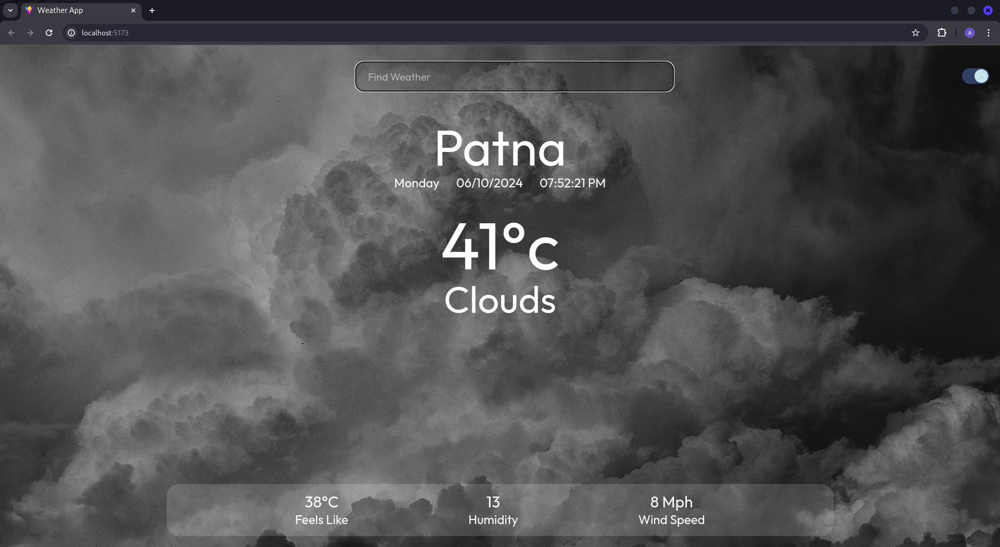
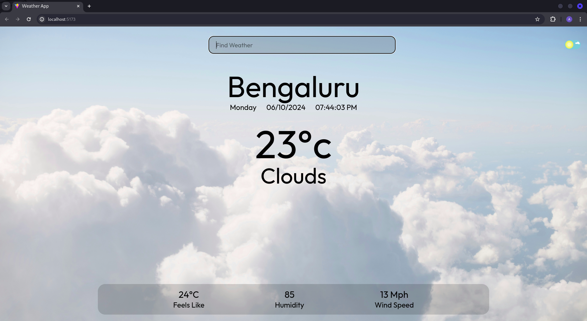

# Weather App



This is a simple weather application built using React, Tailwind CSS for styling, and Axios to fetch data from APIs. It provides real-time weather information based on the user's location input.

## Features

- Real-time weather information using the OpenWeatherMap API.
- Responsive design for mobile, tablet, and desktop devices.
- Dark mode and light mode toggle for better user experience.
- Utilizes Google Fonts for aesthetic typography.

## Prerequisites

Before running this application, make sure you have the following installed on your system:

- Node.js
- npm (Node Package Manager)

## Installation

To run this application locally, follow these steps:

1. Clone the repository to your local machine:
   ```bash
   git clone https://github.com/yourusername/weather-app.git
Or download and extract the files:
Download the ZIP file from the repository's main page.
Extract the ZIP file to a desired location on your system.

2. Navigate to the project directory:
   ```bash
   cd Project1
3. Install the required dependencies:
   ```bash
   npm install
4. Install Axios for API requests:
   ```bash
   npm install axios

## Usage

To start the development server and run the application locally, use the following command:

1. Make sure you are in src folder:
   ```bash
   cd src
2. Run the command:
   ```bash
   npm run dev
3. You will be provided by a port number in terminal click (ctrl+left mouse button) on that link e.g(http://localhost:3000).

## Usage

1. Open the application in your web browser.
2. In the search box, type the name of the location for which you want to find the weather.
3. Press the Enter key to initiate the search.
4. The application will display the current weather information for the entered location, including temperature, weather conditions, and the local time.


## Credits
1. Toggle button design: https://uiverse.io/rishichawda/fluffy-robin-48
2. Fonts: Google Fonts

## Enjoy using the Weather App! If you encounter any issues or have suggestions for improvements, feel free to open an issue on GitHub.


